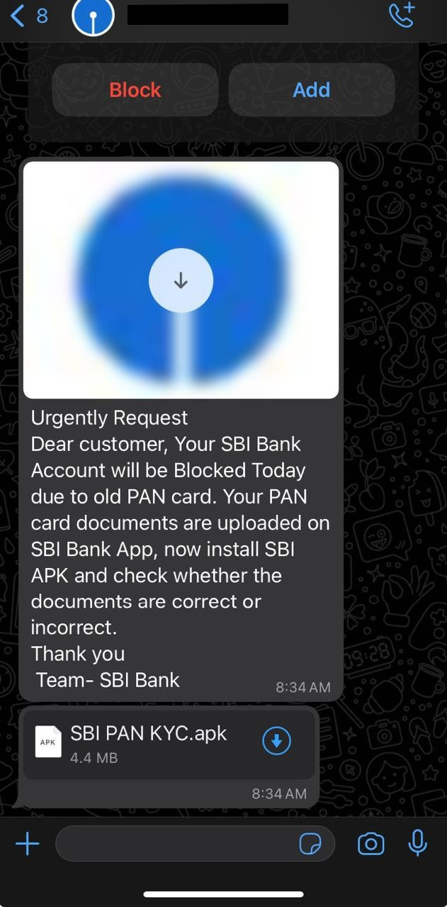
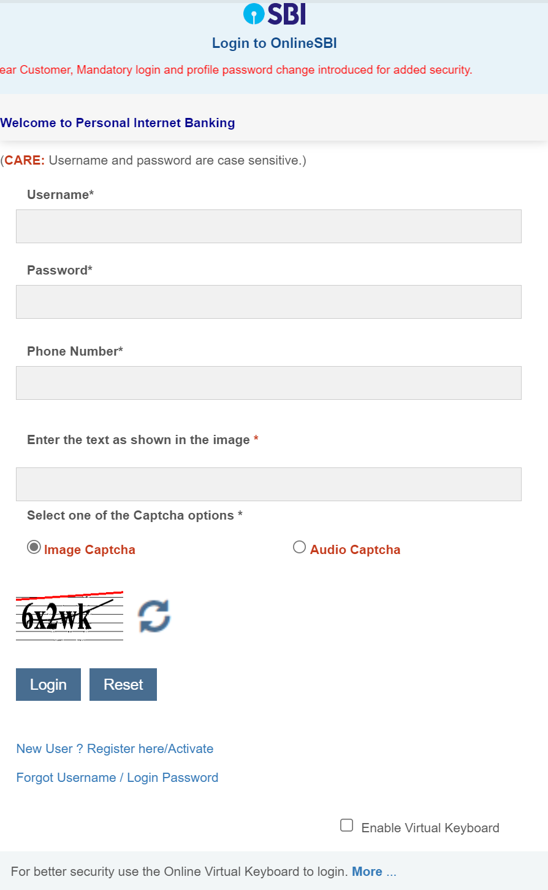
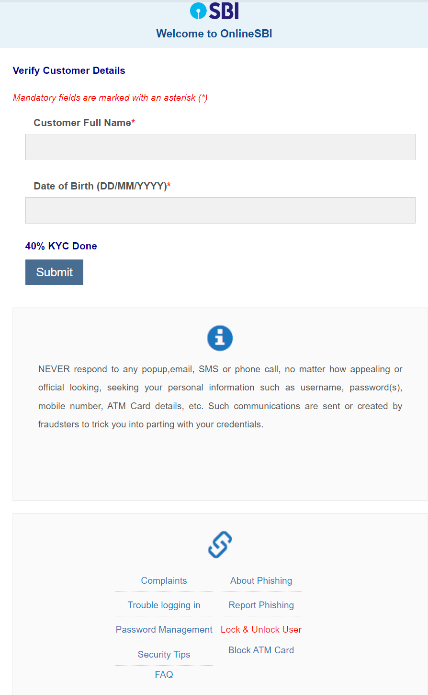
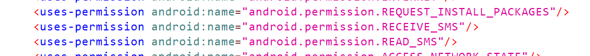
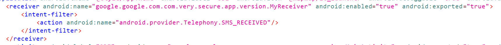

A friend of mine received an interesting WhatsApp message recently.

A phishing scam of some kind. Let's look inside the APK.

Interestingly, it isn't a native Android app. It's made with [Capacitor](https://capacitorjs.com/), with a native component. This means it's possible to view the complete UI of the app on any browser (with JS disabled of course!).

It's clearly trying to replicate the official OnlineSBI website. After you 'login', you're taken through a series of steps where you enter various types of personal information as 'KYC', complete with fake loading screens in the middle. Each step logs the submitted information to a Firebase Realtime Database. This is completely unauthenticated, so opening `https://something-default-rtdb.firebaseio.com/.json` in a browser leaks all of their collected data. Depressingly, there's quite a lot of legit-looking information.

Let's move on to the native Android part. Looking at the manifest with [jadx](https://github.com/skylot/jadx), there's a few concerning permissions:

There's also a broadcast receiver for SMSes:

The SMS receiver dumps the text of all received messages into another unsecured Firebase Realtime Database. The project URL can be found trivially from the APK's string resources. There also appears to be some unused functionality for installing an APK from a file.

The behaviour of this app is entirely transparent - there isn't a hint of obfuscation, which makes sense considering its purpose. Its malicious behaviour is enabled solely by the user. Regardless, diving into this app was an interesting exercise, and my morbid curiosity hopes I get to see more of this in the future 😅. Until then, we've reported this incident to the government's cybercrime portal.