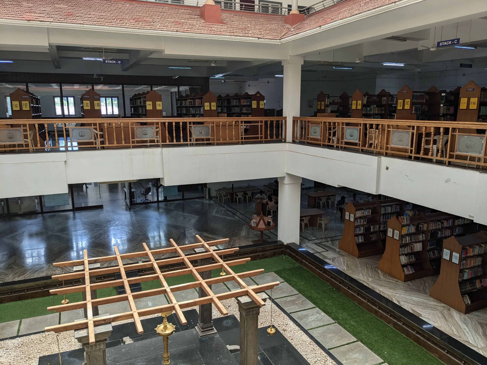

I recently went to Anokha, Amrita Coimbatore's annual tech fest, with [Adithya](https://adithyanair.com), Shravan and Easwer. [This post](https://adithyanair.com/journal/2024-10-19/anokha/) by Adithya is a pretty comprehensive account of our shared experience there. Definitely read that before you continue with this post.

Done? Great. In this post, I'll talk about bits of my own experience I felt like were worth mentioning.

## The campus

As Adithya already waxed lyrical about, the campus is extraordinarily beautiful. Nestled in mountains that just barely scrape the clouds, it was almost surreal. Everywhere you looked could be a painting of its own (except perhaps the inside of the hostel). All the vegetation was perfectly manicured and there were these amazing little sculptures dotted around the campus. All of the primary buildings had amazing architecture, especially academic block 1 and 2, and they were all very neat and clean. There were infinite Third Places to hang out and/or get something done after classes. They even had a butterfly garden. A BUTTERFLY GARDEN. Oh my god.

*click [here](#the-internet) to skip the images*

## The internet

I think it's quite shameful for an engineering college to have heavily restricted/allowlist-only internet. Amrita Coimbatore internet was indeed shameful. Almost everything was blocked, either with a direct connection RST or a special message from the firewall telling you why it was blocked. Even the platform we were using for wikiracing (https://www.thewikigame.com/) was blocked. I couldn't even use my trusty Tailscale exit node like I do in Bangalore. I am also told there's port congestion issues.

We ended up using mobile hotspot the entire time, which wasn't totally pleasant either, with 4 people connected to the same device. At least there was 5G (except for me because I have a Pixel and don't deserve nice things).

The only saving grace for the campus internet was the fact that it was decently fast, at least by Indian college standards - we measured around 25 Mbps on https://speed.cloudflare.com (because every other speedtest site was blocked 🤡). I'm glad I won't have to experience that again for at least another year.

## The hostel

This is one part I was mildly concerned about going into this. I am a day scholar, meaning I have the privilege of living in the comfort of my own home. My only other hostel experience was in MIT ADT for ShunyaCTF, and based on that, I was not particularly looking forward to the second one (not that I blame them at all, of course). This was probably the least beautiful part of the campus we had experienced. All things considered, it was not too bad. The bathing situation was tolerable (granted, we only went at odd times in the evening) and it wasn't excessively dirty. We ended up having a ton of fun there, so I guess I ended up getting a little bit of the hostel experience.

## Getting there

The campus is in the village of Ettimadai, around 20km outside Coimbatore proper. There's a railway station right outside the campus gate, so getting there and leaving is very convenient. The last train is at 7pm, which is usually a pretty reasonable time to leave, but this meant I had to miss Stephen Devassy's incredible show. At least we got to meet Praneeth (link pending) - this absolute legend and systems programmer took us out to dinner in Annapurna. After that was a very intense journey in Coimbatore city as we walked 3km and almost missed our bus home.

## Random pictures

