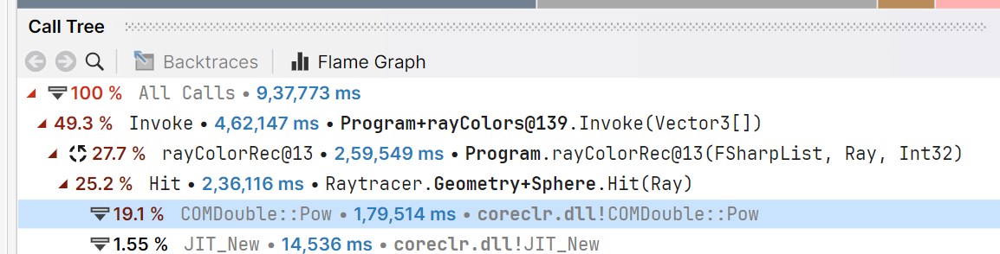

I finished implementing the [Ray Tracing in One Weekend](https://raytracing.github.io/books/RayTracingInOneWeekend.html) book in F#. It's a classic programming project, and I wanted to tick it off my bucket list. I love this kind of book - it's a structured way to taste something new that feels more open-ended than a course.


## Starting off

I originally wanted to do this in Haskell, so that I could build something real in a purely functional language. I figured this would lend itself well to a pure language since it's just a bunch of calculations - a transformation on data. I fought with Haskell's sluggish compile times and inscrutable error messages. My velocity was awful - as someone who doesn't know the language well (and generally 'exploratory' while writing code), I ended up having to paste large parts of my code into `ghci` to figure things out. The process felt worth it though, it was satisfying to write neat little formulae to accomplish each task.

## Random Numbers

Then I got to the point that I needed random numbers. I managed to avoid them until about halfway through - diffuse materials can't exist without them, since they're by definition a random scattering of light. The number that an RNG outputs is a pure function of its internal state, and it produces a series of numbers by modifying that state with each generation. In Haskell, `System.Random` can do this by either:
1. making an immutable RNG instance that always produces the same number, and also returns a new RNG for the next number
2. encapsulating this process using a monad like `State` or `IO`
3. using an `IORef` to create a global mutable RNG.

Using 1 or 2 would mean having to thread an RNG instance or monad into every function that uses it, which is a pain. Using 3 would mean every function that uses the RNG (and its callers and so on) has to be `IO`, making most of the program impure.

This combined with the slow inner loop (and me just wanting to get this done after months of sitting in the freezer), pushed me over the edge to F#.

## F#

I had already used F# for Advent of Code and I had a very pleasant experience with it. It has an expressive language and type system while also allowing side effects anywhere. In this I kinda lost the original motivation (to write this in a purely functional way) but now I just wanted to get this done.

Writing the whole thing in F# did not take long. It ended up following mostly the same abstractions as the C++ version from the book, the only differences were occasional functional-isms like `map` and pipelines. I spent most of my time tracking down nasty vector math bugs (I spent an embarassingly long time doing weird things with my hands and fiddling with GeoGebra), and *making it faster*.

## Optimization

The first F# version was slow as molasses. I would have to wait 50-ish seconds to get a noisy 640x480 image of four spheres at 32 spp, which I eventually brought down to 2 seconds. A lot of these 'optimizations' are just me fixing my own anti-patterns, but the learnings are still valuable.

### Skip `seq`

The first F# version represented the 2D grid of camera rays as a nested `seq`. A `seq` is just a lazy iterator, the same as a Python generator or Java stream. I assumed this would be efficient since it wouldn't have to materialize all of the millions of rays in memory at once (one version that did that used several GB of memory and very little CPU), and that it would be similar to the lazy behaviour of the Haskell version.


It was not efficient at all. It took twice as long to run as the version using arrays, likely because it would have to jump to the sequence expression for every element, removing any data locality or cacheability. The memory usage issue was solved by only pre-allocating the initial rays for each pixel, and generating the array of samples where it was needed.

### System.Numerics.Vector3

At first, I used a hand-rolled Vec3 type with all the operations implemented in F# code. Replacing this with the builtin System.Numerics.Vector3 type made it significantly faster. Although I wasn't able to neatly destructure it in function arguments, the fact that it's hardware accelerated makes a big difference, turning something like a dot product into just a handful of SSE instructions.

### Array.Parallel

This one was almost free. This is a massively parallel problem that will max out as many CPU cores as you throw at it, with no mutable state to worry about (except `Random.Shared` which is conveniently thread-safe already). I found doing each row or each pixel in parallel to be equally fast, and parallelizing each sample to be significantly slower. This is probably because of scheduling overhead when running lots of tiny tasks.

### `pow`

This was the most unexpected one. After changing everything above and seeing big gains, I decided to profile it in dotTrace just out of curiosity (bad practice, I should've been doing this the whole time), and what I saw was unexpected:



Apparently an excessive amount time was being spent in the `pow` function, because of this innocuous-looking snippet:

```fsharp
let c = oc.LengthSquared() - this.Radius ** 2f
let d = h ** 2f - a * c
```

The fact that I was using `h ** 2f` instead of `h * h` was a massive performance problem somehow. I figured this would be a special case that would be optimized internally, or that it wouldn't make a huge difference either way, but apparently this really mattered. Changing this one operator made the final render go from 34 minutes on my computer to 5 and a half minutes. That's insane.

## Closing Thoughts

You can find the source code for this at [heftymouse/raytracer](https://github.com/heftymouse/raytracer). This was a fun little journey and I'm glad to finally tick this off my to-do. On to Crafting Interpreters next!
